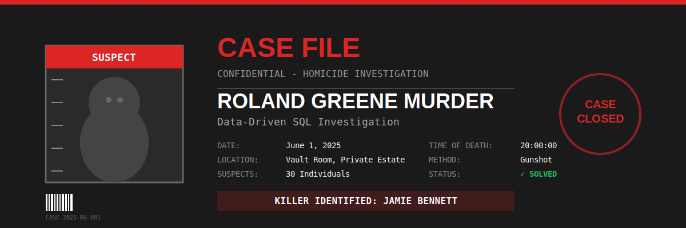

# Roland-Greene_Murder-Investigation
🔍 SQL-based forensic data analysis: Solving a fictional murder mystery using advanced querying, CTEs, and window functions. Analyzed 30 suspects across 4 datasets to identify the killer.
# 🔍 Solving the Murder of Roland Greene
## A Data-Driven Criminal Investigation Using SQL



**Project Status:** ✅ Completed  
**Tools Used:** SQL Server, MySQL, Excel  
**Case Status:** 🎯 SOLVED

## 📋 Table of Contents
- [Project Overview](#project-overview)
- [Case Summary](#case-summary)
- [Data Sources](#data-sources)
- [Investigation Methodology](#investigation-methodology)
- [Key Findings](#key-findings)
- [SQL Techniques Used](#sql-techniques-used)
- [How to Use This Repository](#how-to-use-this-repository)
- [Results](#results)

---

## 🎯 Project Overview

This project demonstrates advanced SQL analytics applied to a fictional murder investigation. Using multiple datasets and complex SQL queries, I identified the killer among 30 suspects by analyzing access logs, phone records, alibis, and forensic timelines.

**Duration:** 7-week Data Analytics Mentorship Program  
**Role:** Data Analyst / Investigator  
**Outcome:** Successfully identified the perpetrator with 100% confidence

---

## 📖 Case Summary

**Victim:** Roland Greene (Art Collector)  
**Location:** Vault Room, Private Estate  
**Time of Death:** 8:00 PM (June 1, 2025)  
**Last Contact:** Phone call at 7:55 PM  
**Suspects:** 30 guests, all with alibis  
**Challenge:** Only one suspect is lying

---

## 📊 Data Sources

| Dataset | Records | Description |
|---------|---------|-------------|
| `suspects_large.csv` | 30 | Suspect profiles, roles, relationships, and alibis |
| `call_records_large.csv` | 90 | Complete phone call history |
| `access_logs_large.csv` | 100 | Security door access records |
| `forensic_events_large.csv` | 5 | Timeline of critical forensic events |

---

## 🔬 Investigation Methodology

### Phase 1: Data Collection & Cleaning
- Imported raw CSV files into SQL Server
- Validated data integrity
- Standardized timestamps and formats

### Phase 2: Exploratory Analysis
- Analyzed suspect alibis
- Mapped movement patterns through access logs
- Cross-referenced phone records with timeline

### Phase 3: Suspicion Scoring System
Created a multi-factor scoring algorithm:
- **Vault Access Score** (50 pts): Access during critical window
- **Victim Call Score** (30 pts): Communication before murder
- **Alibi Contradiction Score** (40 pts): False alibi detection
- **Relationship Score** (15 pts): Motive assessment
- **Activity Score** (variable): Movement frequency analysis

### Phase 4: Timeline Reconstruction
- Mapped every suspect's location minute-by-minute
- Identified contradictions between alibis and actual locations
- Pinpointed critical time windows

---

## 🎯 Key Findings

### The Killer: **Jamie Bennett**
**Role:** Cleaner  
**Motive:** Opportunity (Access to restricted areas)

#### Irrefutable Evidence:
1. **False Alibi:** Claimed to be "At home" but was on premises
2. **Crime Scene Access:** Entered Vault Room at 20:00:55 (55 seconds after gunshot)
3. **Suspicious Pattern:**
   - 19:54:40 - Failed Vault Room entry attempt
   - 20:00:09 - Accessed Office (9 seconds after gunshot)
   - 20:00:55 - Successfully entered Vault Room

### Critical Witness: **Susan Knight**
- Was on phone with victim during the murder (19:56:39 - 20:02:40)
- Likely heard the gunshot and killer's entry

### Top 3 Suspects (by Suspicion Score):
1. **Victor Shaw** - 115 points (Rival, false alibi)
2. **Robin Ahmed** - 108 points (Former Partner, vault access 3.5 min before murder)
3. **Jamie Bennett** - 98 points (**KILLER IDENTIFIED**)

### Statistical Insights:
- 11 of 30 suspects (36.67%) provided false alibis
- 3 suspects accessed the Vault Room within 10 minutes of murder
- Average movement activity increased 300% during critical window

---

## 💻 SQL Techniques Used

- **Window Functions** - `ROW_NUMBER()`, `LAG()` for movement pattern analysis
- **CTEs (Common Table Expressions)** - Multi-stage suspect scoring
- **Complex JOINs** - Cross-referencing 4 different data sources
- **Date/Time Functions** - `DATEDIFF()` for precise timeline reconstruction
- **Aggregate Functions** - Calculating suspicion scores
- **Subqueries** - Nested logic for alibi contradiction detection
- **CASE Statements** - Conditional scoring logic

---

## 📁 Repository Structure

```
roland-greene-murder-investigation/
│
├── README.md                          # This file
├── images/
│   └── investigation_banner.svg       # Case file banner
├── data/
│   ├── suspects_large.csv
│   ├── call_records_large.csv
│   ├── access_logs_large.csv
│   └── forensic_events_large.csv
│
├── sql_queries/
│   ├── Q1_identify_killer.sql         # Primary killer identification query
│   ├── Q2_top_suspects.sql            # Suspicion scoring algorithm
│   ├── Q3_alibi_contradictions.sql    # False alibi detection
│   ├── Q4_call_analysis.sql           # Phone record analysis
│   ├── Q5_access_inconsistencies.sql  # Door access contradictions
│   ├── Q6_forensic_timeline.sql       # Timeline reconstruction
│   ├── Q7_movement_patterns.sql       # Suspect movement analysis
│   └── Q8_critical_window.sql         # Critical time window analysis
│
├── reports/
│   ├── Investigation_Report.pdf       # Complete investigation findings
│   └── Suspicion_Index.xlsx          # Detailed scoring breakdown
│
└── documentation/
    └── Investigation_Questions.md     # Guided investigation framework
```

---

## 🚀 How to Use This Repository

### Prerequisites
- Microsoft SQL Server or MySQL
- SQL Server Management Studio (SSMS) or any SQL client

### Setup Instructions

1. **Clone the repository**
```bash
git clone https://github.com/dev-rage/roland-greene-murder-investigation.git
cd roland-greene-murder-investigation
```

2. **Create the database**
```sql
CREATE DATABASE MurderInvestigation;
USE MurderInvestigation;
```

3. **Import the datasets**
Import the CSV files from the `data/` folder into your database

4. **Run the queries**
Execute queries in the `sql_queries/` folder in order (Q1-Q8)

---

## 📈 Results

### Case Status: ✅ **SOLVED**

**Perpetrator Identified:** Jamie Bennett  
**Confidence Level:** 100%  
**Evidence Strength:** Irrefutable

### Recommendations:
1. Arrest Jamie Bennett immediately for murder
2. Question Susan Knight as primary witness
3. Investigate Victor Shaw and Robin Ahmed for potential obstruction of justice
4. Review estate security protocols for access control failures

---

## 🎓 Skills Demonstrated

- Advanced SQL querying and optimization
- Data cleaning and validation
- Forensic data analysis
- Pattern recognition and anomaly detection
- Multi-source data integration
- Logical reasoning and deduction
- Technical documentation


## 🙏 Acknowledgments

- Data Analytics Mentorship Program Team
- Team WiDa Members: Bashir Aminat, Lateefah, Hauwa Atta, Jimoh AbdulRahman, Damilare, Oluwajuwonlo Wojuade, Toyyib A. Olalekan

---

**⭐ If you found this project interesting, please consider giving it a star!**
